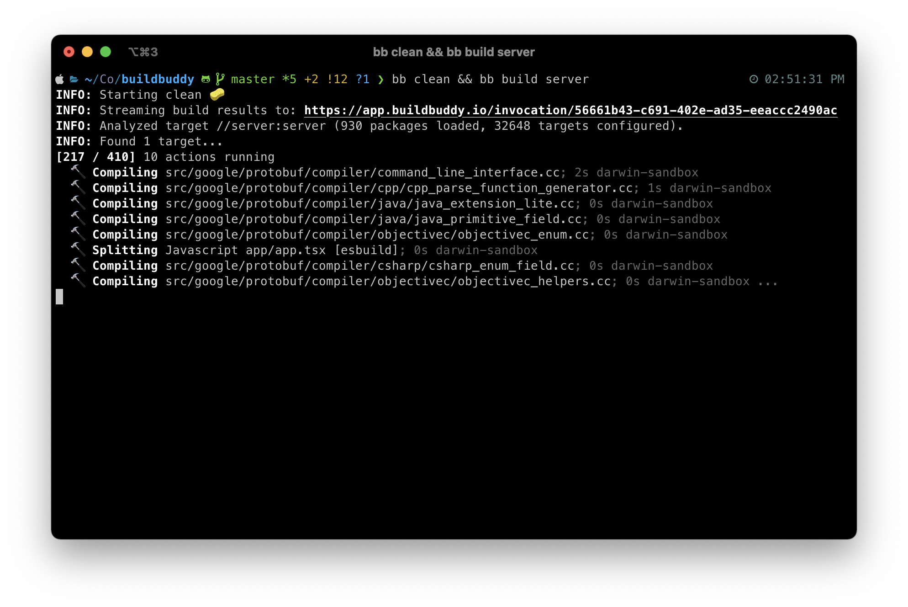

# siggisim/theme-mono

A monochromatic theme plugin for the [BuildBuddy CLI](https://buildbuddy.io/cli)

## Installation

Install this plugin with:

```
bb install siggisim/theme-mono
```

## Screenshot


